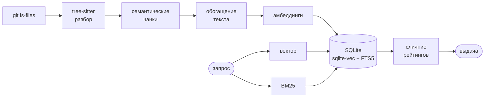

<div align="center">

# findyourcode

### Поиск по коду по смыслу, а не по тексту

**`fyc find "где происходит авторизация пользователя"`** — и находит, даже если слова «авторизация» в коде нет.

[](https://github.com/mekkadev/findyourcode/actions/workflows/ci.yml)
[](https://www.python.org/)
[](LICENSE)
[](#модели)

</div>

---

```console
$ fyc find "где происходит авторизация пользователя"

 1. api/session.py:9-28  class CredentialChecker  [1.000]
     9 class CredentialChecker:
    10     """Validates the login/password pair a client presents at sign-in."""
    11
    12     def check(self, login: str, password: str) -> str:
    13         record = self.users.get(login)
    14         if record is None:
    15             raise PermissionError("unknown login")
    ... 13 more lines

 2. web/middleware.ts:8-20  function guard  [0.769]
     8 export async function guard(ctx: Context, next: () => Promise<void>) {
     9   const header = ctx.headers["authorization"] ?? "";
    10   const ticket = header.startsWith("Bearer ") ? header.slice(7) : "";
    ... 10 more lines
```

Ни `авторизация`, ни `auth`, ни `login` в запросе и коде не совпадают дословно.
Запрос на русском, код на английском, языки разные — находится всё равно.

<table>
<tr><th align="left">Запрос</th><th align="left">Что находит</th></tr>
<tr><td><code>отмена подписки и возврат денег</code></td><td><code>billing/charge.go → func Refund</code></td></tr>
<tr><td><code>разграничение прав по ролям</code></td><td><code>web/middleware.ts → requireRole</code></td></tr>
<tr><td><code>рисование графика на канвасе</code></td><td><code>ui/chart.js → drawSeries</code></td></tr>
<tr><td><code>проверка сертификата сервера</code></td><td><code>ssl.py → get_server_certificate</code></td></tr>
</table>

## За 30 секунд

```bash
pip install -e ".[all]"

cd ~/my-huge-project
fyc index                                  # один раз
fyc find "почему ретраятся платежи"        # дальше — сколько угодно
```

Никаких серверов, докера и облака: индекс — это один файл `.findyourcode/index.db`
рядом с проектом. Модель по умолчанию скачивается один раз (220 МБ) и дальше
работает оффлайн.

## Что умеет

| Команда | Зачем |
|---|---|
| `fyc index` | построить или обновить индекс (инкрементально) |
| `fyc index --watch` | держать индекс свежим, пока вы пишете код |
| `fyc find "..."` | найти код по описанию на любом языке |
| `fyc similar src/auth.py:42` | найти похожий код в других местах проекта |
| `fyc eval cases.json` | измерить качество поиска: recall@k, MRR |
| `fyc status` | что лежит в индексе |
| `fyc clear` | удалить индекс |
| `fyc providers` | какие модели доступны |

```console
$ fyc similar py311/queue.py:100
like py311/queue.py:97-109 method Queue.empty

 1. py311/asyncio/queues.py:95-97   method Queue.empty       [0.758]
 2. py311/asyncio/queues.py:86-88   method Queue.qsize       [0.732]
 3. py311/sched.py:98-101           method scheduler.empty   [0.711]
```

## Как это устроено



Качество такого поиска держится не на одной модели, а на четырёх решениях.

<details open>
<summary><b>1. Границы чанков ставит парсер, а не счётчик байт</b></summary>
<br>

Tree-sitter режет файл по функциям, методам и классам:

- маленький класс — **один чанк**;
- большой класс — **заголовок + чанк на каждый метод**, с breadcrumb `Класс.метод`;
- гигантская функция — **окна с перехлёстом**, помеченные `[2/5]`;
- всё, что не попало в определения (импорты, константы, конфиг), — **блоки**;
- незнакомый язык, Markdown, текст — **построчный fallback** (Markdown режется по заголовкам).

Нарезка «по 500 байт» рвёт функцию посередине, и половина смысла теряется на границе.

</details>

<details open>
<summary><b>2. Перед эмбеддингом чанк переписывается в человекочитаемый вид</b></summary>
<br>

Модель не понимает `checkUserCredentials` — но прекрасно понимает `check user credentials`.
Поэтому в индекс уходит не сырой код, а вот это:

```text
python method CredentialChecker.check
about: Validates the login/password pair a client presents at sign-in.
module: Session issuing and verification for the public API.
names: credential checker check login password record users digest compare ticket
file: api/session.py (api session)
code:
    def check(self, login: str, password: str) -> str:
        ...
```

Строка `module:` — краткое описание всего файла, и она часто решает: метод внутри
`argparse.py` наследует «Command-line parsing library», единственное место, где тема
названа словами.

Порядок полей не косметика: у моделей окно 128–512 токенов, поэтому важное идёт
первым, а сырой код — последним, его всё равно обрежет.

</details>

<details open>
<summary><b>3. Поиск гибридный</b></summary>
<br>

Вектор находит смысл, BM25 находит точные имена вроде `retry_backoff` или `X-Request-Id`.
Порознь оба проваливаются, вместе — работают.

| Режим | Что делает |
|---|---|
| `blend` (по умолчанию) | min-max нормализация, 0.75 семантике / 0.25 лексике, скор 0..1 |
| `rrf` | классическое reciprocal rank fusion по рангам |

Кандидатам, которые пришли только из BM25, доcчитывается точный косинус — иначе
случайное совпадение по слову выбивает правильный ответ с первого места
(проверено: запрос `token validation` и функция, где просто часто встречается `card.Token`).

</details>

<details open>
<summary><b>4. Индекс инкрементальный на двух уровнях</b></summary>
<br>

Файлы сравниваются по sha256, чанки — по хэшу того текста, который уходит в модель.
Правка одной функции переэмбеддит **одну функцию**: остальные чанки файла берут
вектора из предыдущего поколения индекса. Откатили коммит — вектора найдутся в архиве.

```console
$ fyc index                 # после правки одного файла
indexed 1 files (7 chunks), 670 unchanged, 0 removed, 1 embedded, 6 from cache, 0.4s
```

</details>

## Установка

```bash
pip install -e ".[all]"      # локальная модель + sqlite-vec + тесты
pip install -e ".[local]"    # только оффлайн-режим
pip install -e .             # ядро, эмбеддинги через API-провайдера
```

`sqlite-vec` не обязателен: без него вектора лежат в обычной таблице, а KNN считается
numpy-перебором — до сотен тысяч чанков разница незаметна.

## Использование

```bash
fyc index                                     # проиндексировать текущий проект
fyc index --reindex                           # перестроить с нуля
fyc index --workers 16                        # больше потоков парсинга
fyc index --watch                             # следить за правками до Ctrl-C

fyc find "загрузка файлов в s3"
fyc find "rate limit" --lang python --path src/api -n 20
fyc find "миграции схемы" --explain           # показать, кто что нашёл
fyc find "конфиг подключения" -f paths        # path:line для $EDITOR и fzf
fyc find "обработка вебхуков" --json | jq '.[0].path'

fyc similar src/payments/refund.py:88 -n 5
```

<details>
<summary>Все флаги поиска</summary>
<br>

| Флаг | Что делает |
|---|---|
| `-n, --limit` | сколько результатов (по умолчанию 10) |
| `-L, --lines` | строк сниппета; `0` — весь чанк |
| `-f, --format` | `pretty` (по умолчанию), `paths`, `files`, `json` |
| `--lang` | фильтр по языку, можно повторять |
| `--path` | фильтр по подстроке пути, можно повторять |
| `--kind` | фильтр по виду: `function`, `class`, `method`, `interface`, `block`... |
| `--mode` | `hybrid` (по умолчанию), `semantic`, `lexical` |
| `--fusion` | `blend` или `rrf` |
| `--explain` | ранги и скоры каждой ветки поиска |
| `--same-file` | для `similar`: не выкидывать чанки из того же файла |

</details>

Интеграция с редактором — одна строка:

```bash
vim $(fyc find "точка входа воркера" -n 1 -f paths)
fyc find "флаги фичи" -f paths | fzf --preview 'bat --style=numbers {1}'
```

## Модели

| Провайдер | Модель по умолчанию | Окно | Комментарий |
|---|---|---|---|
| `local` | `paraphrase-multilingual-MiniLM-L12-v2` | 128 токенов | 220 МБ, оффлайн, 50+ языков запроса |
| `local` | `intfloat/multilingual-e5-large` | 512 токенов | 2.2 ГБ, заметно точнее, медленнее |
| `voyage` | `voyage-code-3` | 32k токенов | лучшее качество на коде, нужен `VOYAGE_API_KEY` |
| `openai` | `text-embedding-3-small` | 8k токенов | нужен `OPENAI_API_KEY`, работает и с совместимыми API |
| `hash` | — | — | детерминированный лексический fallback без зависимостей |

```bash
fyc index --model intfloat/multilingual-e5-large
fyc index --provider voyage
```

Индекс привязан к модели: сменили модель — `fyc index --reindex`. Иначе инструмент
откажется мешать несовместимые векторные пространства, а не выдаст мусор молча.

## Конфигурация

`.findyourcode.toml` в корне проекта. Любое поле переопределяется переменной окружения
`FYC_<ПОЛЕ>` или флагом CLI.

```toml
[findyourcode]
provider = "local"
model = ""
max_chunk_lines = 110      # больше — крупнее чанки, меньше — точнее адресация
overlap_lines = 12
alpha = 0.75               # вес семантики при слиянии
oversample = 8             # во сколько раз глубже черпать кандидатов
exclude = ["**/generated/**", "*.pb.go"]
include = []               # если непусто — индексируется только это
workers = 8
```

Список файлов берётся из `git ls-files -co --exclude-standard`, то есть `.gitignore`
соблюдается автоматически. Вне git-репозитория — обход директорий со встроенными
исключениями.

## Цифры

Замер на CPython stdlib: 671 файл, 14 525 чанков, обычный CPU, провайдер `local`.

| | |
|---|---|
| полная индексация | **329 с** (~44 чанка/с, упирается в модель) |
| повторный `fyc index` без правок | **0.5 с** |
| `--reindex` после правки нарезки | **29 с** (14 525 векторов из 15 000 — из кэша) |
| поиск | **2–4 с** на холодном процессе (из них ~1.5 с — загрузка модели) |
| размер индекса | **72 МБ** |

### Качество измеряется, а не декларируется

В комплекте есть `fyc eval` — прогон по набору «запрос → ожидаемый файл» с recall@k и MRR.
Это не украшение: именно им подобран дефолтный `alpha`.

```console
$ fyc eval examples/eval_stdlib.json --sweep

  setting           recall@1  recall@3  recall@10     MRR
  -------------------------------------------------------
  blend a=0             0.61      0.69       0.83   0.673
  blend a=0.25          0.64      0.72       0.83   0.696
  blend a=0.5           0.67      0.75       0.83   0.711
  blend a=0.75          0.69      0.75       0.86   0.738   ← дефолт
  blend a=1             0.61      0.69       0.83   0.672
  semantic              0.61      0.69       0.83   0.672
  lexical               0.25      0.33       0.47   0.308
  rrf                   0.64      0.75       0.83   0.699
```

36 запросов ко всей stdlib: 26 смысловых («очередь для обмена данными между потоками»)
и 10 по точным именам (`pbkdf2_hmac`, `wrap_socket server_hostname`). Выводы:

- **гибрид обгоняет обе ветки поодиночке** — и это ровно то, ради чего он есть;
- на одних смысловых запросах чистая семантика выигрывает, на точных именах —
  проваливается; поэтому бенчмарк смешанный, иначе он подсказал бы неверный дефолт;
- пик по `alpha` — плато 0.70–0.75, дефолт стоит на нём.

Честно про потолок: recall@1 = 0.69 значит, что примерно в трети случаев нужный файл
не первый. Ограничение — дефолтная модель со 128-токенным окном: она видит имя,
докстринг и описание модуля, но не тело функции. Нужна точность выше — возьмите
`multilingual-e5-large` или `voyage-code-3` и прогоните тот же `fyc eval`, чтобы
увидеть разницу на своём коде, а не на чужих обещаниях.

```bash
fyc eval my_cases.json              # свой набор кейсов
fyc eval my_cases.json --sweep      # подобрать alpha под свой репозиторий
```

## Языки

Python, JavaScript, TypeScript, TSX, Go, Rust, Java, Kotlin, Swift, Scala, Ruby, PHP,
C#, C, C++, Lua, Bash, Elixir и остальные из `tree-sitter-language-pack`.
Для незнакомых расширений работает построчный fallback, так что файл не пропадает
из индекса, даже если грамматики нет.

## Устройство кода

| Модуль | Ответственность |
|---|---|
| `walker.py` | какие файлы вообще смотреть (git, глобы, бинарники, размер) |
| `chunker.py` | tree-sitter → чанки с именами, родителями и докстрингами |
| `enrich.py` | чанк → текст для эмбеддинга |
| `embeddings/` | провайдеры: `local`, `voyage`, `openai`, `hash` |
| `store.py` | SQLite: чанки, вектора, FTS5, кэш, инкрементальность |
| `search.py` | два ретривера, слияние, дедуп, `similar` |
| `evaluate.py` | recall@k и MRR на наборе кейсов |
| `indexer.py` | конвейер индексации и параллелизм |
| `cli.py` / `format.py` | команды и вывод |

```bash
pytest                    # 58 тестов, идут на провайдере hash — сеть не нужна
cd examples/demo_repo && fyc index && fyc find "проверка пароля"
```

## Что дальше

- [x] `fyc index --watch` — держать индекс свежим во время работы
- [ ] MCP-сервер, чтобы агенты искали тем же индексом
- [ ] переранжирование топа cross-encoder'ом
- [ ] расширение запроса (HyDE) для очень коротких запросов

<div align="center">
<br>
MIT · сделано для тех, кто устал грепать чужой монорепозиторий
</div>
